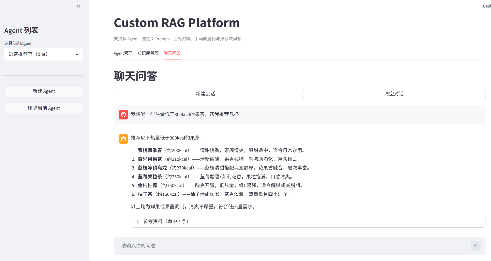
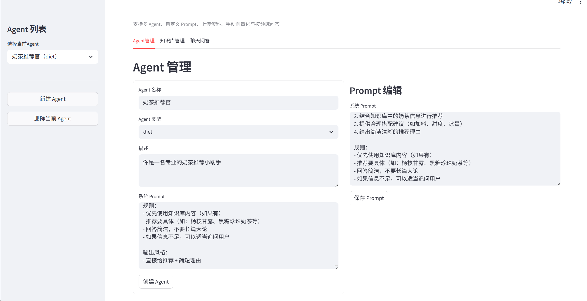
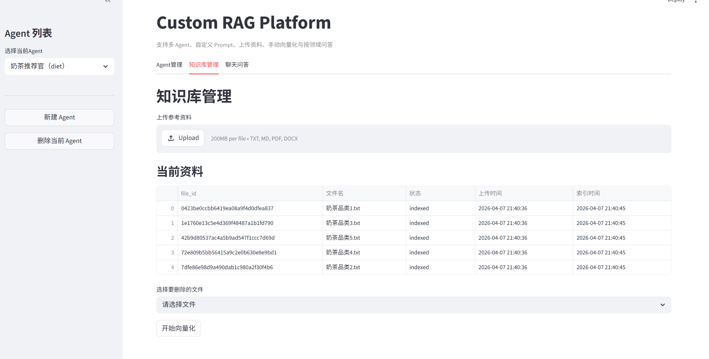

A modular, extensible Retrieval-Augmented Generation (RAG) platform built with LangChain 1.x, Chroma, and DashScope LLMs.

Overview
RAG Platform is a production-oriented AI agent framework that combines retrieval (RAG) and reasoning (Agent) into a unified system. It is designed for rapid development of intelligent applications such as:
AI customer service systems
Recommendation engines
Knowledge-based QA systems
Automated report generation
Prompt optimization for generative AI
The project emphasizes modularity, scalability, and reusability, making it suitable for both academic projects and real-world applications.

🖥️ Demo Preview

Features
🤖 Multi-Agent System
Create and manage multiple agents
Agent-level configuration isolation
Dynamic agent switching
Independent conversation context per agent
📚 Knowledge Base (RAG)
Supports TXT / PDF ingestion
Automatic document chunking
Embedding via DashScope
Vector storage using Chroma
Knowledge isolation per agent
💬 Intelligent Chat
ReAct-based agent architecture
Tool calling support
Context-aware conversations
Session management with reset capability
🛠 Tooling System
Built-in tools include:
rag_summarize – retrieval + summarization
get_user_id
get_current_month
fetch_external_data
fill_context_for_report
Easily extensible with custom tools.
📊 Observability
Tool execution logging
Prompt debugging support
Structured runtime logs

Architecture
User Input
   ↓
Streamlit UI
   ↓
Agent Service
   ↓
LangChain Agent (ReAct)
   ↓
Tools / RAG Retrieval
   ↓
Vector Store (Chroma)
   ↓
Embedding Model (DashScope)
   ↓
LLM (ChatTongyi)
   ↓
Response

Project Structure
rag_platform/
├── app.py
├── services/
├── rag/
├── tools/
├── ui/
├── utils/
├── config/
├── data/
├── chroma_db/
└── requirements.txt

Installation
1. Clone the repository
git clone https://github.com/your-username/rag-platform.git
cd rag-platform

2. Create virtual environment
python -m venv .venv

3. Activate environment
.venv\\Scripts\\activate   # Windows

4. Install dependencies
pip install -r requirements.txt

5. Install DashScope SDK
pip install dashscope

6. Set API Key
set DASHSCOPE_API_KEY=your_api_key

Usage
streamlit run app.py
Open browser:
http://localhost:8501

Core Components
AgentService

Manages agent lifecycle, configuration, and switching.

RagService

Handles document retrieval, context construction, and LLM interaction.

VectorStoreService

Responsible for embedding, storage, and retrieval.

Tool System

Encapsulates external capabilities and integrates with ReAct workflow.

🔧 Design Principles
Decoupling: Agent logic separated from RAG pipeline
Config-driven: YAML-based configuration
Extensibility: Plug-and-play tools and models
Modularity: Clean layered architecture
🚀 Roadmap

💡 Use Cases
Enterprise knowledge assistant
AI recommendation systems
Educational AI tools
Data analysis agents
Prompt engineering assistants
🤝 Contributing

Contributions are welcome! Feel free to open issues or submit pull requests.

📄 License

MIT License

⭐ Acknowledgements
LangChain
Chroma
DashScope (Alibaba Cloud)
📌 Final Note

This project serves as a reusable AI agent foundation for building next-generation intelligent systems.
